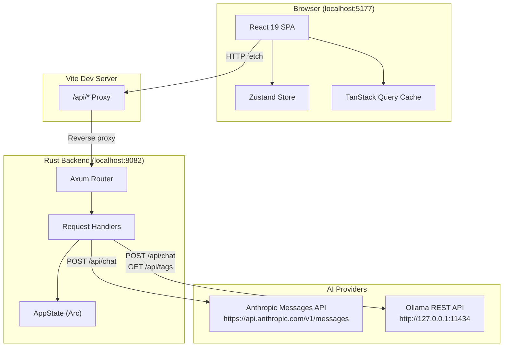
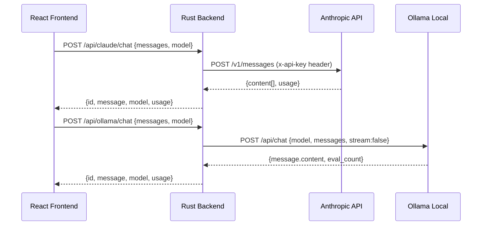
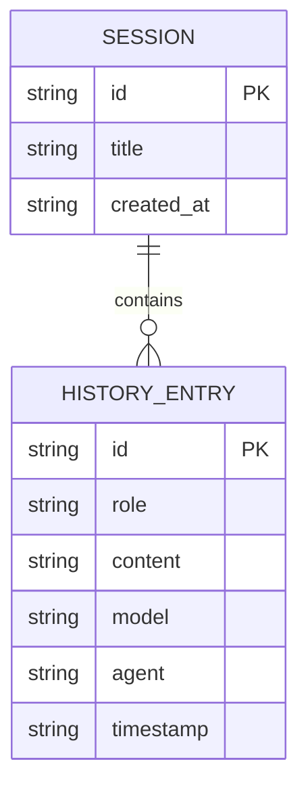
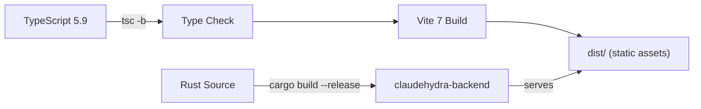

# Architecture

## System Overview

ClaudeHydra v4 is a dual-provider AI chat platform with a React SPA frontend and a Rust/Axum backend. The backend acts as a unified proxy, forwarding chat requests to either the Anthropic Messages API (Claude) or a local Ollama instance, while managing sessions, agents, and settings in memory.



## Dual Provider Architecture

Both providers share a common `ChatRequest` / `ChatResponse` contract. The backend normalizes responses so the frontend does not need to know which provider is active.



### Normalized Response

Both providers return the same `ChatResponse` shape:

```json
{
  "id": "uuid-or-anthropic-id",
  "message": {
    "role": "assistant",
    "content": "Response text...",
    "model": "claude-sonnet-4-20250514",
    "timestamp": "2026-02-12T10:30:00Z"
  },
  "model": "claude-sonnet-4-20250514",
  "usage": {
    "prompt_tokens": 42,
    "completion_tokens": 128,
    "total_tokens": 170
  }
}
```

## Backend Architecture

### State Management

All state lives in `Arc<Mutex<AppState>>`, shared across Axum handlers:

```
AppState
  +-- settings: AppSettings     # theme, language, ollama_host, default_model
  +-- agents: Vec<WitcherAgent>  # 12 pre-initialized Witcher agents
  +-- sessions: Vec<Session>     # Chat sessions with message history
  +-- current_session_id: Option<String>
  +-- api_keys: HashMap<String, String>  # ANTHROPIC_API_KEY, GOOGLE_API_KEY
  +-- start_time: Instant        # For uptime calculation
  +-- client: reqwest::Client    # Shared HTTP client (connection pooling)
```

No external database or Redis. Sessions persist only for the lifetime of the backend process. This was an intentional simplification from v3 (which used Redis).

### Request Flow

1. Vite dev server receives `/api/*` requests from the browser
2. Proxy forwards them to `http://localhost:8082`
3. Axum router dispatches to the matching handler
4. Handler locks `AppState`, reads/writes data, releases lock
5. For chat endpoints, the handler makes an outbound HTTP request to the chosen provider
6. Response is normalized and returned as JSON

### CORS

The backend allows requests from `http://localhost:5177` and `http://127.0.0.1:5177` (the Vite dev server). In production builds, the frontend is served as static files and CORS is not needed.

## Frontend Architecture

### Layer Diagram

```
  Views (Features)
    |
  Organisms (AppShell, Sidebar, ErrorBoundary)
    |
  Molecules (CodeBlock, ModelSelector, StatusIndicator)
    |
  Atoms (Button, Card, Badge, Input, ProgressBar, Skeleton)
    |
  Design Tokens (CSS Variables in globals.css)
```

### State Architecture

| Layer            | Technology     | Scope                                |
|------------------|----------------|--------------------------------------|
| Server state     | TanStack Query | API data (agents, health, sessions)  |
| Client state     | Zustand        | UI state (active view, sidebar)      |
| Form state       | React state    | Local component state                |
| Theme state      | CSS variables  | `data-theme` attribute on `<html>`   |

### Feature Modules

Each feature is self-contained with its own API layer, components, hooks, and stores:

```
features/
  chat/
    api/          # Chat API calls (claude, ollama)
    components/   # ChatInput, MessageBubble, OllamaChatView
    hooks/        # useChatMutation, useModels
    stores/       # Chat-specific Zustand slice
    index.ts      # Public exports
  agents/
    api/          # Agent list API
    components/   # AgentsView, AgentCard
    hooks/        # useAgents query hook
    stores/       # Agent filter state
    index.ts
  ...
```

## Session Management

Sessions group chat messages into named conversations:



- Sessions are created via `POST /api/sessions`
- Messages are appended via `POST /api/sessions/{id}/messages`
- The full session (with all messages) is retrieved via `GET /api/sessions/{id}`
- Session listing (`GET /api/sessions`) returns summaries (no message bodies) for performance

## Build Pipeline



In production, the Rust binary can serve the `dist/` folder as static files, eliminating the need for a separate web server.
